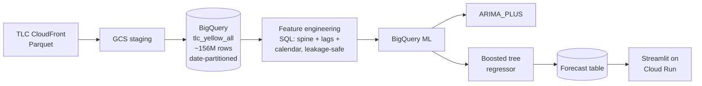

# NYC Taxi Zone-Hour Demand Forecasting

Forecasting hourly taxi pickup demand for every NYC taxi zone, built entirely in BigQuery ML and served through a Streamlit dashboard on Cloud Run.

**[Live dashboard →](https://taxi-dashboard-20157239246.us-central1.run.app/)**

<!-- Add a screenshot or short GIF of the dashboard here. A visual is the single biggest thing that makes a recruiter stop scrolling. -->
<!--  -->

---

## What it does

Given a taxi zone and an hour, the system predicts how many yellow-taxi pickups to expect. It's trained on roughly 156 million trips spanning January 2022 through April 2026, and it's evaluated against a seasonal-naive baseline (last week, same hour) rather than against zero, because beating a real baseline is the only result worth reporting.

The headline number: across the city, the model's forecast error (WAPE) is **19.76%**, versus **23.40%** for the seasonal-naive baseline — about a **15.5% relative improvement**. More importantly, **215 of 263 zones (81.7%) individually beat the baseline**, so the gain isn't coming from a handful of high-volume zones carrying the average.

## Results

### Citywide evaluation (Mar–Apr 2026 holdout)

| Metric | Model | Seasonal-naive baseline |
|---|---|---|
| Citywide WAPE | **19.76%** | 23.40% |
| Zones beating baseline | **215 / 263 (81.7%)** | — |
| Median zone WAPE | **0.685** | 0.786 |
| 90th-percentile zone WAPE | 2.41 | — |

WAPE (weighted absolute percentage error) is the primary metric instead of MAPE. MAPE divides by actual demand, which blows up on the many zone-hours that legitimately have zero pickups at 4am. WAPE weights by volume and stays finite. The 90th-percentile number is deliberately included: quiet zones with low traffic show high *percentage* error even when the *absolute* miss is one or two trips. That's a real limitation of forecasting sparse series, not something to hide.

### Model bake-off (reference zone 237, Jan 2022 holdout)

Before scaling up, three approaches were compared on a single well-behaved zone:

| Model | MAE | RMSE |
|---|---|---|
| Seasonal-naive (lag 168h) | 36.90 | 67.96 |
| ARIMA_PLUS (per-zone) | 37.66 | 68.04 |
| Boosted tree (single zone) | 31.95 | 42.06 |
| Boosted tree (joint, all zones) | **29.46** | — |

Two findings drove the rest of the project. ARIMA_PLUS lost to the naive baseline on this data, so per-zone classical time series was dropped. And the *joint* gradient-boosted model — one model trained across all zones at once — beat the single-zone specialist on zone 237. A model that sees every zone learns shared patterns (rush hour, weekday/weekend shape) that a single-zone model never gets enough data to learn well.

## Architecture



Everything from raw trips to predictions lives in BigQuery. There's no separate training infrastructure: features are SQL views, models are `CREATE MODEL` statements, and predictions are `ML.PREDICT` queries. The dashboard reads the forecast table directly.

## Data

Trip records come from the [NYC TLC trip data](https://www.nyc.gov/site/tlc/about/tlc-trip-record-data.page), pulled from the TLC CloudFront Parquet endpoint (`https://d37ci6vzurychx.cloudfront.net/trip-data/`) rather than the BigQuery public mirror. The mirror had a gap in December 2022, and a forecasting model that learns on a timeline with a hole in it produces corrupted lag features. The CloudFront source is the authoritative one.

Zone definitions and holiday flags come from BigQuery public datasets (`bigquery-public-data.new_york_taxi_trips` for the zone lookup and `bigquery-public-data.ml_datasets.holidays_and_events_for_forecasting`).

No raw data is committed to this repo. The ingestion script downloads and loads it; see [`ingestion/`](ingestion/).

## Feature engineering

The features are mostly lag and calendar signals, and the whole pipeline is built to avoid target leakage:

- **Spine first.** Taxi data is event-level and "holey" — an hour with no pickups produces no row, not a zero row. A `CROSS JOIN` of zones × hours builds a complete grid, and counts are joined onto it. Zero pickups becomes a genuine 0 (it's a real count), but missing *history* for a lag never gets faked to 0.
- **Per-zone windows.** Every window function carries `PARTITION BY pickup_location_id`. Drop it and lag values silently bleed from one zone into the next.
- **Frames stop at `1 PRECEDING`.** Rolling averages end one hour before the row being predicted, never at `CURRENT ROW`, so a feature can never peek at its own target.
- **One continuous timeline.** The multi-year history is a single unbroken series. Stacking separate years on top of each other would create artificial discontinuities at every year boundary and corrupt the lag features that cross them.

Weather (NOAA GSOD) is the next regressor to fold in; it's wired into the feature schema but not yet in the headline model.

## Cost notes

BigQuery bills by bytes scanned, not rows. Two habits keep the bill small:

- The trip table is **date-partitioned** on pickup datetime, and every query carries a **half-open partition filter** (`>= start AND < next_start`) so it never scans the whole 156M-row table.
- The schema is treated as the source of truth — `pickup_location_id` is a `STRING`, not an integer, and BQML tree models pick up string columns as categorical with no manual encoding.

## Repo structure

```
nyc-taxi-demand-forecasting/
├── README.md
├── requirements.txt
├── LICENSE
├── .gitignore
├── ingestion/
│   ├── 01_upload_to_gcs.sh        # CloudFront Parquet → GCS (streamed)
│   ├── 02_load_raw.sh             # GCS → per-year raw BigQuery tables
│   └── 03_normalize.sql           # → one partitioned table, tlc_yellow_all
├── sql/
│   ├── 01_features/
│   │   ├── 01_select_zones.sql    # volume-floor zone selection (historical)
│   │   └── 02_hourly_features.sql # spine + leakage-safe lags + calendar + holidays
│   ├── 02_models/
│   │   ├── 01_arima_plus.sql
│   │   ├── 02_boosted_zone237.sql
│   │   └── 03_boosted_all_zones.sql   # the final joint model
│   └── 03_evaluation/
│       ├── 01_seasonal_naive_baseline.sql
│       └── 02_wape_evaluation.sql
├── app/
│   ├── streamlit_app.py           # the dashboard (two tabs)
│   ├── Procfile                   # Cloud Run launch command (buildpacks)
│   └── requirements.txt
└── results/
    └── evaluation_summary.md
```

## Reproducing it

You'll need a GCP project with BigQuery enabled and the `bq` / `gcloud` CLIs authenticated.

```bash
# 1. Ingest: stream TLC Parquet to GCS, load to BigQuery, normalize
bash ingestion/01_upload_to_gcs.sh
bash ingestion/02_load_raw.sh
bq query --use_legacy_sql=false < ingestion/03_normalize.sql

# 2. Build features, then train the final model, then evaluate
bq query --use_legacy_sql=false < sql/01_features/02_hourly_features.sql
bq query --use_legacy_sql=false < sql/02_models/03_boosted_all_zones.sql
bq query --use_legacy_sql=false < sql/03_evaluation/02_wape_evaluation.sql

# 3. Run the dashboard locally
pip install -r app/requirements.txt
streamlit run app/streamlit_app.py
```

Deploying the dashboard to Cloud Run uses buildpacks straight from source — no Dockerfile. From inside `app/`:

```bash
gcloud run deploy taxi-dashboard \
  --source . --region us-central1 \
  --allow-unauthenticated --memory 1Gi
```

The `Procfile` supplies the launch command; Cloud Run injects `$PORT` at runtime. First visit after idle has a few-seconds cold start (the scale-to-zero tradeoff that keeps it free).

## Limitations and what's next

- **Sparse zones are hard.** Low-traffic zones drive the high-percentile error. Forecasting a series that's zero most of the time is genuinely difficult, and percentage metrics punish it heavily.
- **No weather yet.** NOAA GSOD features are staged but not in the headline model. Rain and temperature should help most at the margins (sudden demand spikes).
- **Yellow taxis only.** Green taxis and for-hire vehicles (Uber/Lyft) are a much larger share of current trips and aren't modeled here.
- **Vertex AI serving** is a planned upgrade; right now predictions are precomputed in BigQuery and read by the dashboard, which is simpler and adequate for the demo.

## Tech stack

BigQuery, BigQuery ML (ARIMA_PLUS and boosted tree regressor), Python (`google-cloud-bigquery`, `pandas`, `pyarrow`), GCS, Streamlit, Cloud Run.

## License

MIT — see [LICENSE](LICENSE).
